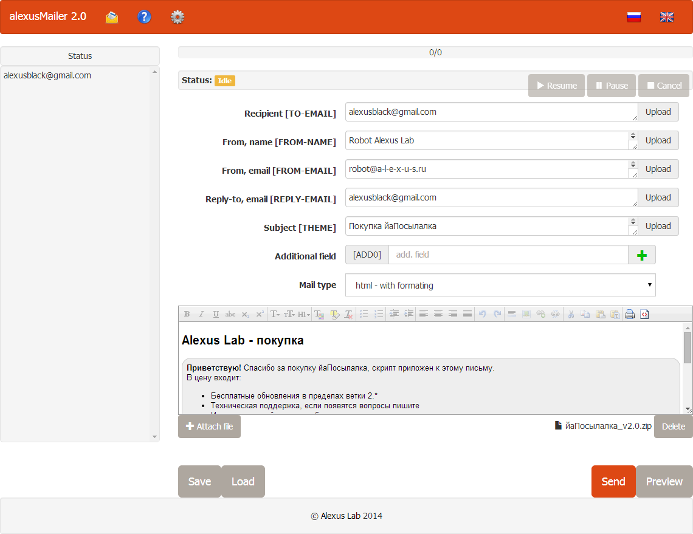
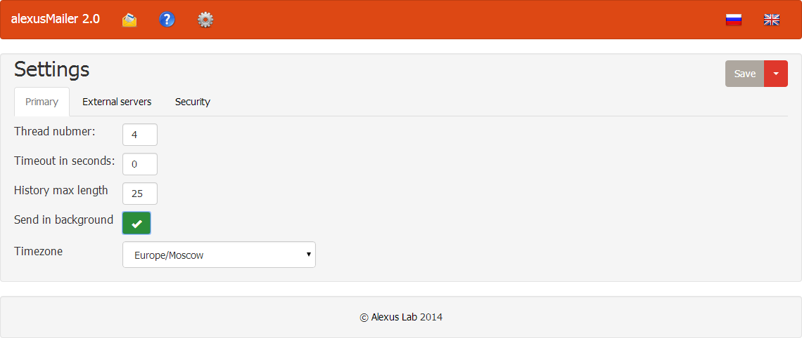
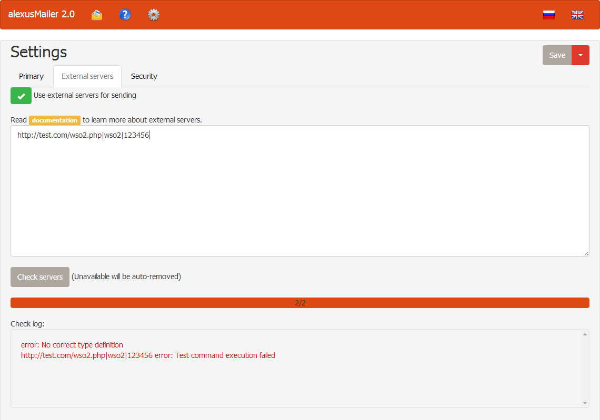

# alexusMailer 2 \ йаПосылалка 2
alexusMailer 2.* - sendmail anonymous mailing script.

йаПосылалка 2.* - скрипт анонимной отправки электронной почты

## English

[Documentation Online](http://mailer.a-l-e-x-u-s.ru/en/faq/) (TODO: must be moved to github)

[Documentation PDF](../../raw/master/FAQ_v2.0.5.en.pdf)

[Demonstration service, sending is disabled](http://mailer.a-l-e-x-u-s.ru/en/demo/)

###[Download](../../raw/master/alexusMailer_latest.zip)
Old version (1.*) can be found [here](https://github.com/AlexusBlack/alexusMailer-1)

####Functionality:
- Multithreading emailing with history (History size can be changed from settings)
- Can send in background (you can close script page)
- Visual editor (and raw code editor)
- API for communication between alexusMailer and other scripts or applications
- Can load recipients and all major fields from files
- Macroses in email text and all fields
- Unlimited amount of additional fields
- Saving and loading email template (Backwards compatibility with 1.* templates)
- Auto attaching images from  tag and background attribute in html(e) mode
- All major fields are multiline and can enumerate while sending
- Preview
- Authorization on script
- Unlimited amount of attachments to email
- Optional delay
- Balancing through external servers by web shells (wso2, r57, c99, ars)
- Web Shell cheking with log
- http proxy for communications between alexusMailer and web shells
- Personalization tools for emails
- Needs only php and sendmail

####Important problems & goals:
- Add CC\BCC fields OR custom headers field
- Additional fields remove button
- ARS with password generation in alexusMailer
- SPF & DKIM
- Test email in background sending mode
- Socks5 proxy
- rewrite JS to use modular approach
- smtp sending module SMTP.shell.php

## Russian

[Документация Онлайн](http://mailer.a-l-e-x-u-s.ru/faq/) (TODO: надо перенести на github)

[Документация PDF](../../raw/master/FAQ_v2.0.5.ru.pdf)

[Демонстрационный сервис, отправка отключена](http://mailer.a-l-e-x-u-s.ru/en/demo/)

###[Скачать](../../raw/master/alexusMailer_latest.zip)
Старую версию (1.*) можно найти [тут](https://github.com/AlexusBlack/alexusMailer-1)

####Функционал:
- Многопоточная отправка с историей (Длину истории можно поменять в настройках)
- Отправка в фоне (можно закрыть страницу со скриптом)
- Визуальный редактор (и редактор кода)
- API для взаимодействия с другими скриптами и приложениями
- Можно загружать получателей и все основные поля из файлов 
- Макросы в теле письма и полях
- Неораниченное количество дополнительных полей
- Сохранение и загрузка шаблонов писем (Обратная совместимость с шаблонами 1.*)
- Автоприкрепление картинок из img тегов и атрибута background во вложения
- Все основные поля многострочные и могут перебираться во время отправки
- Предпросмотр
- Авторизация на скрипте
- Неограниченное количество вложений
- Опциональный интервал между отправками
- Балансировка отправки через несколько серверов (через шеллы - wso2, r57, c99, ars)
- Лог проверки шеллов
- http proxy для взаимодействия между йаПосылалкой и шеллами
- Инструменты персонализации рассылки
- Нужен только php и sendmail (на сервере откуда идет отправка)

####Важные проблемы и задачи:
- Добавить поля CC\BCC или возможно прописывать свои заголовки вручную
- Кнопка удаления дополнительных полей
- Генерация ARS скрипта на стороне йаПосылалки с указанным паролем
- SPF & DKIM
- Тестовое письмо не отправляется в фоновом режиме
- Поддержка Socks5 proxy
- переписать JS используя модульный подход
- сделать модуль отправки через smtp -  SMTP.shell.php

####Статьи:
- [Установка йаПосылалка 2.0+ на веб сервера (хостинг, VPS, Dedicated)](http://mailer.a-l-e-x-u-s.ru/articles/how-to-install-alexusmailer-on-server/)
- [Большие почтовые рассылки с помощью йаПосылалка (использование шеллов)](http://mailer.a-l-e-x-u-s.ru/articles/using-shells-with-alexusmailer/)
- [Рандомизация изображений в письмах йаПосылалка через Image Randomizer](http://mailer.a-l-e-x-u-s.ru/articles/randomizing-images-with-image-randomizer/)

###Screenshots \ Скриншоты
####Main Screen \ Главный экран

####Main settings \ Главные настройки

####Distribution \ Распределение рассылки

